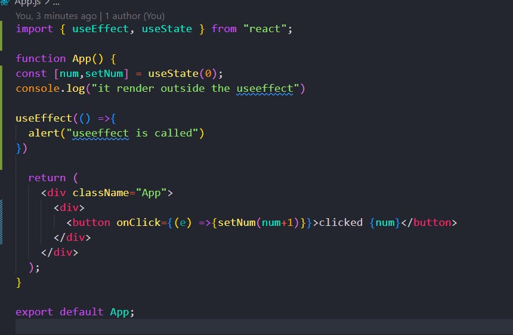
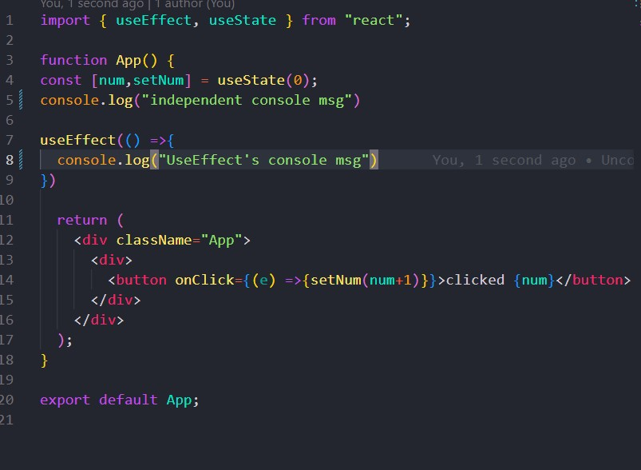
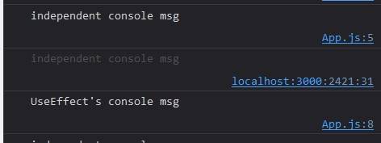
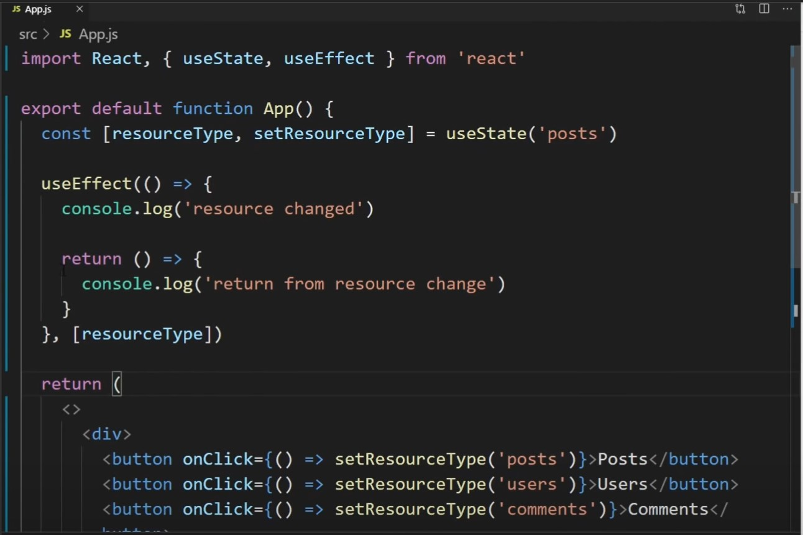
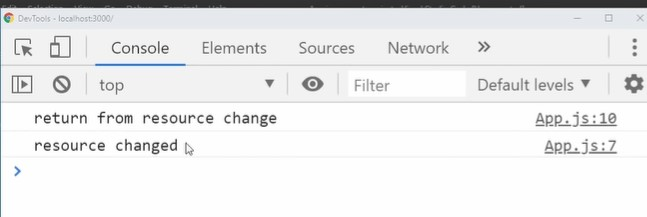

# Getting Started with Create React App

This project was bootstrapped with [Create React App](https://github.com/facebook/create-react-app).

## Available Scripts

In the project directory, you can run:

### `npm start`

Runs the app in the development mode.\
Open [http://localhost:3000](http://localhost:3000) to view it in your browser.

The page will reload when you make changes.\
You may also see any lint errors in the console.

### `1.`
  ### `This file is created for the notes while learning how to use react`
  `useEffect`
   In a simple Languages, useEffect is the method of performing the task that has sideEffect on the function or element
   

  `CODE: `
  

  In the above code useEffect is being used when the webpage get rendered

`the alert method is getting called when the page is refreshed`
### Similarly the console.log which is called independently inside the component is called first and useeffect is get called
* first independent console 
* second useEffect console 




`-------------------------------------------------------------------------------`


### `2.`



* In this, useState is used to updated the value and useEffect is used to console when the resourceType is clicked/changed




*  Here return function inside useEffect is used to clear up the code when the useEffect is being called as shown in the console msg above.
### In conclusion:
* The callback function inside useEffect is executed after the initial render and after every subsequent re-render by default. If you want to run the effect only once, you can pass an empty array ([]) as the second parameter. This effectively tells React that the effect has no dependencies,so it doesn't need to re-run.

* If you provide a dependencies array, the effect will only be re-run if any of the dependencies change. React will compare the current dependencies with the previous ones and determine if the effect should run again.

* Inside the effect callback, you can perform any asynchronous or synchronous operations. You can also return a cleanup function, which will be executed before the component is unmounted or re-rendered. The cleanup function is useful for cleaning up any resources, event listeners, or subscriptions created by the effect.

### Here are some scenarios when you might want to use the useEffect hook:

* Fetching data: When you need to fetch data from an API or perform an asynchronous operation, you can use useEffect to initiate the request and handle the response.

* Subscribing to events: If you need to listen for events like mouse clicks, keyboard input, or scroll events, you can use useEffect to set up event listeners and clean them up when the component unmounts.

* Modifying the DOM: When you need to interact with the DOM directly, such as manipulating elements, changing styles, or adding event listeners, you can use useEffect to perform these operations.

* Setting up timers: If you want to schedule a task to run after a specific interval or at a particular time, you can use useEffect to set up timers, such as setTimeout or setInterval, and clear them when the component unmounts.

* Subscribing to data or state changes: When you want to respond to changes in data or state, you can use useEffect with dependencies. By specifying dependencies, you can trigger the effect whenever the dependencies change.

It's important to note that useEffect runs after every render by default. However, you can provide a dependency array as the second argument to control when the effect should run. This array contains values that the effect depends on, and if any of those values change, the effect will be re-run.

# useContext

The `useContext` hook in React allows you to access the value of a context in a functional component. Context provides a way to share data between components without having to pass props manually at every level of the component tree.

* To use useContext, you need to follow these steps:

1. Create a context using the React.createContext function. This function returns a context object that consists of two components: Provider and Consumer.

```
// Create a context
 const MyContext = React.createContext();
 ```

2. Wrap the parent component or any ancestor component that wants to share the data with its child components using the Provider component. The Provider component accepts a value prop which specifies the value you want to share.

```
// Wrap the parent component with the Provider
<MyContext.Provider value={/* value to be shared */}>
  {/* Child components */}
</MyContext.Provider>
```
3. In any child component that wants to access the shared value, import the context object and use the useContext hook to access the value.

```
import React, { useContext } from 'react';

// Inside a child component
const MyComponent = () => {
  const contextValue = useContext(MyContext);

  // Use the context value in your component
  // ...
};
```
* The useContext hook takes the context object as an argument and returns the current value provided by the nearest MyContext.Provider up the component tree. It automatically subscribes the component to context updates, so whenever the value of the context changes, the component will re-render.

* It's important to note that useContext can only be used within the body of a functional component or another custom hook. It cannot be used in regular JavaScript functions or class components. Also, make sure the Provider component is higher up in the component tree than the components that consume the context.

* By using useContext, you can access the shared data without passing props through intermediate components, making your code cleaner and more efficient.
* By using useContext, you can access the shared data without passing props through intermediate components, making your code cleaner and more efficient.

# useRef
* In React, the useRef hook is a built-in hook that allows you to create a mutable reference to an element or a value. Unlike the useState hook, using useRef doesn't trigger a re-render when the value it holds changes. It's commonly used to access and manipulate DOM elements directly, manage focus, or store values that persist across renders without causing re-renders.
```
import React, { useRef } from 'react';

function MyComponent() {
  // Creating a ref for a DOM element
  const myElementRef = useRef(null);

  // Creating a ref for a value
  const countRef = useRef(0);

  const incrementCount = () => {
    countRef.current += 1;
    console.log("Count:", countRef.current);
  };

  return (
    <div>
      <div ref={myElementRef}>This is a DOM element</div>
      <button onClick={incrementCount}>Increment Count</button>
    </div>
  );
}


```

* In this example, the myElementRef ref is used to reference a DOM element, and the countRef ref is used to store a value that persists across renders.
* Also note that while useRef can be used to access and manipulate DOM elements, it's generally recommended to use React's state management and props system to handle changes in your application's UI. Using useRef for DOM manipulation should be reserved for cases where it's necessary to interact with the DOM directly, such as managing focus or measuring element dimensions.
### Theories:

`Functional Programming Parts`

* First-class function/citizen/object means that functions are treated just like any other data types.

1. Assign function to variable

2. Pass function as argument (This is concept which allows us to write higher-order functions that take function as argument to customize)

3. Return functions from other functions

4. Store functions in data structures: You can store functions in data structures like lists, arrays, or dictionaries. This enables you to create collections of functions and manipulate them in various ways.(source: programmingwithmosh, composing and piping)
* Composing: Default behaviour of functions pass as parameter inside function left to righr

* Pipe: Behavior of functions pass as parameter right to left

* Examples of composing and pipe


### Composing

```
const tranform = compose(wrapInDiv,toLowerCase,trim) #passing function as parameter inside compose
```


### Pipe
* we cannot pass a string in a pipe function


```
const tranform = pipe(trim,toLowerCase,wrapInDiv) 

```


# Higher order functions
* Higher-order function is the function that either takes one or more functions as argumentes or returns a function as its result 
Examples:

1. map:
```
const numbers = [1, 2, 3, 4, 5];
const squared = numbers.map(x => x * x);
console.log(squared); // [1, 4, 9, 16, 25]

```
2. filter:
```
const numbers = [1, 2, 3, 4, 5];
const evens = numbers.filter(x => x % 2 === 0);
console.log(evens); // [2, 4]
```

3. forEach:The forEach function takes an array and a callback function as arguments. It iterates over each element of the array and applies the callback function.

```
const colors = ['red', 'green', 'blue'];

colors.forEach(color => console.log(color));
// Outputs:
// red
// green
// blue

```
# Currying:

* It's a technique in Js that means function returning function
```
function add(a){
  return function(b){
    return +b;
  }
}

const add2 =  a => b => a+b;  //(a,b) = a+b

add(1)(5); //add(1,5)

```

# Pure function: 
* It's a function that produces the same output for the same given input and doesn't cause any observable side effects 
 
 1. we cannot use random value  (map.random)
 2. we cannot use current date/time 
 3. we cannot change global(external state) state like DOM,files,db etc

 Example of Pure Function

 ```
 function add(a, b) {
  return a + b;
}

 ```
 * It takes argument and perform task without modify any external state and doesn't rely on any external state.

 Example of Not Pure Function

 ```
 let total = 0;
function addToTotal(num) {
  total += num;
  return total;
}
 ```
 * In this case, addToTotal function is not pure because it modifies the external state `total` everytime it's called, and its output depends not only on its input but also on the current state of total

 `Since they don't have side effect.they are less likely to make bugs or unexpected error behavior in our code.`

 # Benefits of Pure Functions:

1. Self- documenting: A functions contain all the info inside itself.
```
function func(a,b){
  // a and b parameter is the info inside function 
}
```
2. Easily tastable: Because we are not using global state, it easier for us to test it.

3. Concurrency: 

4. Cacheable: By knowing the output of function func(a,b) with parameter a and b(which is user intake)  we can optimize them by reading it from cache.

```
function func(a,b){
  // a and b parameter is the info inside function 
}
```

 # Mutable & Immutable:

* its just the term used to describe if and object's state can be changed after it's created or not.

1. Mutable(objects including arrays and functions): An object is considered mutable if its internal state(values,properties or elements) can be modified after the object is created This means i can chffange its properties or elements without creating a new object.
```
let mutableArray = [1, 2, 3];
mutableArray.push(4); // Modifies the original array by adding an element
console.log(mutableArray); // Output: [1, 2, 3, 4]

```

2. Immutable(numbers,strings and booleans): An object is considered immutable if it's internal state connot be changed after it's created. Instead of modifying the object, any operation that appears to modify it actually creates a new object with the desired changes, leaving the original object unchanged.

```
let immutableString = "Hello";
let newString = immutableString.concat(", World!"); // Creates a new string by concatenation
console.log(immutableString); // Output: "Hello"
console.log(newString); // Output: "Hello, World!"

```

### Updating object:

```
const person =  {name:"john"};
const updated = {...person, name:"raj"}; //spread operator ...  
console.log(updated); //{name:"raj"}

```

* To use  library of js for immutable

`npm i immutable`
* normal object is wrap by 'map()' function

* 'get()' is used to get the element inside object
```
import {Map} from 'immutable'
let book = Map({title:"Harry potter"});
console.log(book.get("title"))
```


* for the result in console just like plain js we need to use toJS()


```
import {Map} from 'immutable'
let book = Map({title:"Harry potter"});

console.log(book.toJS()) //{title:"Harry potter"} which is plain js
```

